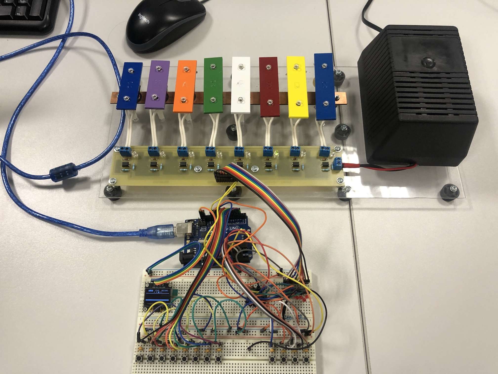
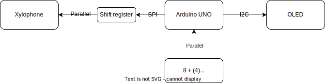
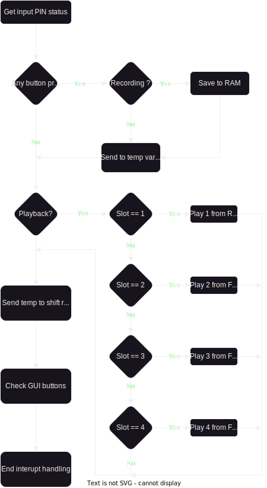

<!--HTML styling 
<style>
.custom-image {
  width: 700px;
  height: auto;
  display: block;
  margin-left: auto;
  margin-right: auto;
}
</style>

<style>
.diagram {
  width: 400px;
  height: auto;
  display: block;
  margin-left: auto;
  margin-right: auto;
}
</style>
!-->

# DE2 project - Electronicaly controled xylophone
The student project operated within the Bachelor's program of [Digital Electronics 2](https://github.com/tomas-fryza/digital-electronics-2/tree/master/labs/09-project) at Brno University of Technology.



### Team members

* Marek Coufal (SPI shift register, FLASH memory)
* Martin Ťavoda (GPIO interupt handling, notes recording)
* Miloslav Kužela (GPIO setup and read functions, documentation, doxygen)
* Roman Vaněk (OLED Graphical user interface, doxygen management)

## Theoretical and hardware description
The xylophone consists of individual xylophone bricks that have a coil with a magnetic rod under them, that rises and hits the notes when a current is passed through it. The switching is handeled by LTV-817-C opto-coupler. The couplers are controled by a 74HC595 shift register that is connected to the arduino. The whole assembly is powered by a switching powersupply that has an output of 24VDC.

As mentioned above, due to GPIO restriction of used MCU, we used a shift register for the controling of the individual notes. It uses SPI for communication. Rest of the digital IO pins are used as inputs connected to buttons with enabled pull ups. Final hardware part is an OLED display which is connected with an I2C communication interface.

#### Connection diagram:
<p align="center">
<source media="(prefers-color-scheme: dark)" srcset="img/Theoretical_diagram.sv">
<source media="(prefers-color-scheme: light)" srcset="img/Theoretical_diagramlight.svg">

</p>


#### Xylophone board schematic:
<p align="center">

</p>

#### Arduino circuit:
<p align="center">

</p>

## Software description
Full software doxygen documentation available at [Xylophone DOC](https://marouncz.github.io/digital-electronics-2-project/).

### Used libraries
|**Library**|**Description**|
| :--| :-- |
  [GPIO](Xylossphone/lib/gpio/gpio.h) | Contains functions for controling GPIO pins
  [GUI_LED](Xylophone/lib/gui_oled/gui.h) | Contains functions that handle the user interface displayed on an OLED screen
  [OLED](Xylophone/lib/oled/oled.h) | Library for controling an OLED screen
  [SONGS](Xylophone/lib/songs/songs.h) | Contains header files with songs and timestamps that are later stored in FLASH
  [SPI](Xylophone/lib/spi/spi.h) | Library for SPI communication
  [TWI](Xylophone/lib/twi/twi.h) | Library for I2C communication
  [UART](Xylophone/lib/uart/uart.h) | Library for UART communication

### Initialization
This part of the code contains mostly calls to functions from libraries [`GPIO`](Xylophone/lib/gpio/gpio.h), [`SPI`](Xylophone/lib/spi/spi.h) and [`GUI`](Xylophone/lib/gui_oled/gui.h). They serve to setup the correct GPIO directions, communication speed and User interface layout. Lastly Timer1 is set to overflow every 4ms and an interupt is enabled.

```C
GPIO_setup_xylophone(); // Pin direction setup
  SPI_init();
  GPIO_mode_input_pullup(&DDRD, 2);
  uart_init(UART_BAUD_SELECT(115200, F_CPU));

  // Init GUI on oled display
  gui_init();

  TIM1_OVF_4MS;
  TIM1_OVF_ENABLE;
  sei();
```

### Main loop
Only the GUI update call is located in the main loop. Its purpose is to fetch if a note is pressed and show it as a visual idicator. The main loop is othervise left unsused. Everything else is handeled by a timer1 interrupt.

```C
// Main loop
  while (1)
  {
    // UI
    if (regData_d > 0)
    {
      gui_sheet_set(regData_d);
      regData_d = 0;
    }
  }
```

### Timer1 overflow

Since the timer overflows every 4ms the interrupt function is used as a loop. Firstly it checks if any button state has changed. Then checks if the recording flag is set, if so it records the button status and saves its timestamp(number of overflows).

```C
static uint8_t regData = 0;
  regData = 0;

  GPIO_read_pins(&currButtonState);

  for (uint8_t i = 0; i < sizeof(dingTime); i++)
  {
    if (currButtonState[i] == 0 && prevButtonState[i] == 1)
    {
      dingTime[i] = DING_DUR;
      if (recFlag)
      {
        memory_note[memoryCounter] = i;
        memory_timeStamp[memoryCounter] = timeStamp;
        memoryCounter++;
        uart_putc(memoryCounter + 48);
      }
    }
    if (dingTime[i] > 0)
    {
      regData |= (1 << i);
      dingTime[i]--;
    }
  }
  regData_d = regData;
```

Function then continues and checks if the playback mode is set, If it is then it runs the according melody algorithm. Lastly it check the GUI buttons and pushes the output to the shift register. 
This then repeats again every ***4ms***. Every note stays on for ***4 loops***, which is ***16ms***. Holding the button for any longer will not effect this. It is possible to play during the playback phase, because both algorithms write into the same temporary output register which is later sent to the output.

#### Basic flowchart describing the timer overflow handling:
<p align="center">
<source media="(prefers-color-scheme: dark)" srcset="img/Counter_overflow_interupt.svg">
<source media="(prefers-color-scheme: light)" srcset="img/Counter_overflow_interupt_light.svg">

</p>


## Instructions
### 1. Powering on
Make sure that the xylophone and arduino are both plugged in. If everything is correct, pressing any note button should play a sound accompanied by a visual indication on the OLED display.

### 2. Free play
After powering on, the unit is ready to play. Press any button and play whatever song or melody you want.

### 3. Recording
Pressing the record button, while having the first melody slot selected will start the recording of played notes. ``RECORD`` will get highlighted on the display. To stop the recording press the STOP button, which stops and saves the recording to RAM. If you have UART monitoring, you can observe an output of notes and their timestamps.
> **Note:** The maximum recording length is 70 notes, exceeding the limit will stop the recording

### 4. Playback
The program has 4 memory slots, which the last three are prerecorded melodies located in FLASH memory. You can cycle between them using the select button. After selecting the wanted memory slot you can play it using the PLAY button.
> **Note:** For adding/changing your own melodies in FLASH see: [Crating your own melodies](#creating-your-own-melodies-on-flash-memory)

### [Video demonstration](https://youtu.be/ymcIcWMrQOg)

## Creating your own melodies on FLASH memory
When in the recording mode, after playing all your notes and pressing the STOP button. A string of all the notes and their accordig time stamps get sent to UART. You can then copy these strings and put them into their according arrays in the [songs.h](Xylophone/lib/songs/songs.h) header file.

## References

1. Xylophone original board designed by Čepek Hlaváč
2. [ATMEGA328P datasheet](https://ww1.microchip.com/downloads/en/DeviceDoc/Atmel-7810-Automotive-Microcontrollers-ATmega328P_Datasheet.pdf)
3. [74HC595 datasheet](https://www.ti.com/lit/ds/symlink/sn74hc595.pdf)
4. Learning materials from Digital Electronics 2 course.
5. Libraries from [Digital-Electronics-2](https://github.com/tomas-fryza/digital-electronics-2) github repository.

<!-- ## Contribution guide

Your code should be documented in doxygen supported syntax.
> **Note:** For full introduction doxygen documentation see [here](https://embeddedinventor.com/guide-to-configure-doxygen-to-document-c-source-code-for-beginners/).

Here is and example of a Doxygen type documentation for function xylophone:
```c
/**
 * @brief Plays a melody on a virtual xylophone.
 *
 * This function simulates playing a melody on a xylophone. It takes a sequence
 * of notes and produces sound accordingly. The function uses the XYZ algorithm
 * for optimal note generation.
 *
 * @param[in] melody An array of integers representing the notes of the melody.
 * @param[in] duration The duration of each note in milliseconds.
 * @param[out] sound_level The volume level of the xylophone sound (0-100).
 *
 * @return The total duration of the melody playback in milliseconds.
 *
 * @note Ensure that the xylophone is properly initialized before calling this function.
 * @warning This function may produce loud sounds; use caution when adjusting the sound level.
 * @see initialize_xylophone()
 *
 * Example usage:
 * @code
 *   int melody[] = {NOTE_C, NOTE_E, NOTE_G, NOTE_C};
 *   int duration = 500;
 *   int sound_level = 75;
 *   int total_duration = xylophone(melody, duration, sound_level);
 * @endcode
 */
int xylophone(const int melody[], int duration, int *sound_level);
``` -->
