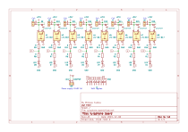

# DE2 project - Synthesizer
The student project operated within the Bachelor's program of [Digital Electronics 2](https://github.com/tomas-fryza/digital-electronics-2/tree/master/labs/09-project) at Brno University of Technology.
### Team members

* Marek Coufal (SPI shift register, )
* Martin Ťavoda (GPIO interupt handling, recording)
* Miloslav Kužela (GPIO setup and read functions, documentation)
* Roman Vaněk (OLED Graphical user interface, doxygen management)

## Theoretical description and explanation

[Block diagram](https://app.diagrams.net/#G1r2vdGk2f0OClIlirRXJdd-qQVvmi0gxV)


## Hardware description of demo application
The xylophone consists of individual xylophone bricks that have a coil with a magnetic rod under them, that rises and hits the notes when a current is passed through it. The switching is handeled by LTV-817-C opto-coupler. The couplers are controled by a shift register that is connected to the arduino. The whole assembly is powered by a switching powersupply that has an output of VDC.



As mentioned above, due to GPIO restriction of used MCU, we used a shift register for the controling of the individual notes. It uses SPI for communiation. Rest of the digital IO pins are used as inputs connected to buttons with enabled pull ups. Final hardware part is an OLED display which is connected with an I2C interface.

## Software description
Full software doxygen documentation available at [Xylophone DOC](https://marouncz.github.io/digital-electronics-2-project/).

Put flowchats of your algorithm(s) and direct links to source files in `src` or `lib` folders.

## Instructions
### Powering on
Make sure that the xylophone and arduino are both plugged in. If everything is correct, pressing any note button should play a sound accompanied by a visual indication on the OLED display.
```Image of the powered up unit```

### Free play
After powering the unit is ready to play. Press any note button and play whatever song or melody you want.

### Recording
Pressing the record button will start the recording of played notes. Recording should get highlighted on the display.
To stop the recording press the STOP button which stops and saves to recording.
The maximum recording length is *40* notes, after exceeding the limit the recording is stopped and saved automaticaly.
User recording accupies the last memory slot.

### Playback
The program has 3 memory slots, which the first two are prerecorded melodies and the last one is reveserved for the user. You can cycle between them using the select button. After selecting the wanted memory slot you can play it using the PLAY button.

## References

1. Xylophone board designed by 
2. 

## TO-DO
Nakreslit schémátka, video/fotky, dodělat gui interaction

## Contribution guide

Your code should be documented in doxygen supported syntax.
> **Note:** For full introduction doxygen documentation see [here](https://embeddedinventor.com/guide-to-configure-doxygen-to-document-c-source-code-for-beginners/).

Here is and example of a Doxygen type documentation for function xylophone:
```c
/**
 * @brief Plays a melody on a virtual xylophone.
 *
 * This function simulates playing a melody on a xylophone. It takes a sequence
 * of notes and produces sound accordingly. The function uses the XYZ algorithm
 * for optimal note generation.
 *
 * @param[in] melody An array of integers representing the notes of the melody.
 * @param[in] duration The duration of each note in milliseconds.
 * @param[out] sound_level The volume level of the xylophone sound (0-100).
 *
 * @return The total duration of the melody playback in milliseconds.
 *
 * @note Ensure that the xylophone is properly initialized before calling this function.
 * @warning This function may produce loud sounds; use caution when adjusting the sound level.
 * @see initialize_xylophone()
 *
 * Example usage:
 * @code
 *   int melody[] = {NOTE_C, NOTE_E, NOTE_G, NOTE_C};
 *   int duration = 500;
 *   int sound_level = 75;
 *   int total_duration = xylophone(melody, duration, sound_level);
 * @endcode
 */
int xylophone(const int melody[], int duration, int *sound_level);
```
